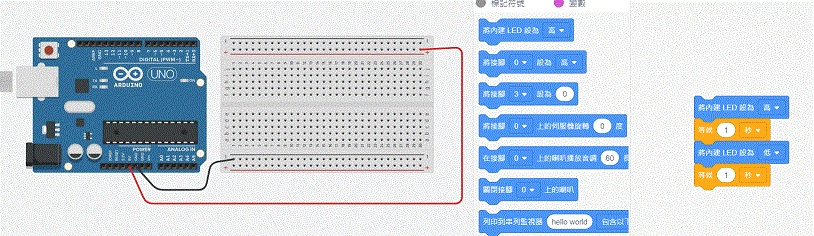
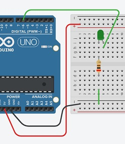
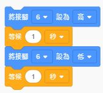
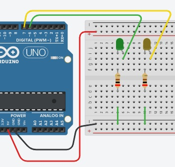
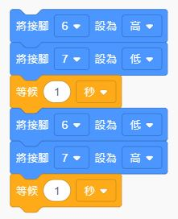
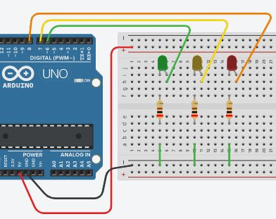
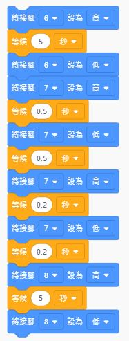

### 1 內建LED
在 Tinkercad 中加入一片 UNO 板，它就內含一段簡單程式，執行後將內建LED點亮及熄滅

其中將接腳設為高就點亮，設為低就熄滅。在亮滅之間要加入等待時間，讓亮滅分開。

### 2 外接LED
在麵包板上做出LED電路如右圖，並將陽極接到 UNO 的 6腳作為控制端

並將程式中的"內建LED" 改成 接腳6，如右圖，完成外接LED之控制。

### 3 雙燈閃爍
再做另一組 LED，這次用 7 做為控制腳。

加入程式中接腳 7 的部分，6、7的電壓相反，一個亮另一個就滅。

### 4 紅綠燈
再加一組 LED，將顏色配成綠黃紅三色，控制腳在 8。

調整每個燈亮滅的順序及時間，就可以做成紅綠燈程式。

這個是綠燈亮 5秒後黃燈閃 2次，最後紅燈在亮 5秒。
