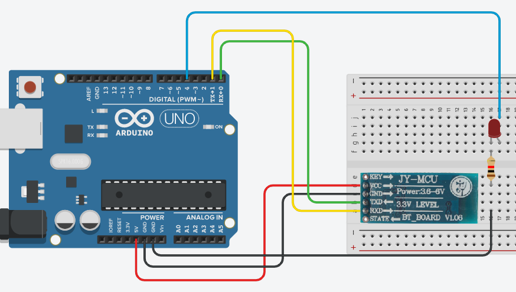

## 藍牙設定

1. 照下圖連接<br>


2. 將 UNO 板跟電腦連接，把 TX RX (綠線及黃線) 拔除。

3. 開啟 Arduino IDE，寫入一個空的程式。

4. 將 TX RX (綠線及黃線) 接回，開啟 "序列埠監控視窗"，並如下圖做設定。<br>


5. 在 "序列埠監控視窗" 中輸入 AT 按 Enter，重複到出現  OK 。

6. 輸入 AT+name? 查詢現有的名字，輸入 AT+name:新名字 更改晶片名字。

7. 輸入 AT+PSWD:新密碼，更改晶片連入密碼。

8. 輸入 AT+UART:9600，更改晶片連線速度。

## 藍牙使用

1. 照下圖連接<br>


2. 輸入以下程式<br>

```C
#include <SoftwareSerial.h>
#include <Wire.h>

int LED = 4;
char BTdata;

SoftwareSerial BT(0,1);     //定義 Arduino PIN 0 及 PIN 1 為RX及TX腳

void setup()
{
 Serial.begin(9600);
 BT.begin(9600);
 pinMode(LED, OUTPUT);  
}
void loop()
{
 //讀取藍牙模組，並傳送到序列埠視窗
 if (BT.available()){
    BTdata=BT.read();
    Serial.println(BTdata);  
 }
 //切換LED
 switch (BTdata){ 
  case 'F':
    digitalWrite(LED,HIGH);
    break;
  case 'B':
    digitalWrite(LED,LOW);
    break;
  }
}
```

3. 把 TX RX (綠線及黃線) 拔除，將程式寫入後再把兩線插回去。

4. 以 App Inventor 寫一個小程式，可以分別送出 'F' 跟 'B'，以之測試此電路。


